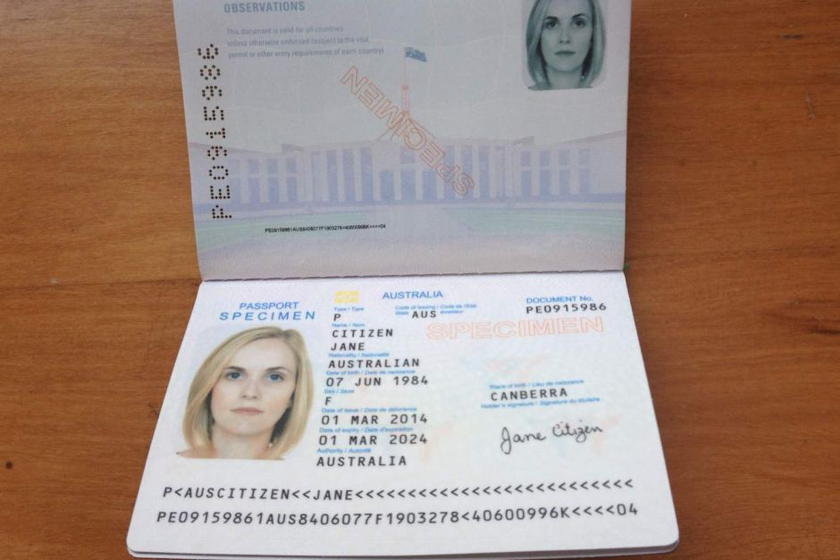

# Passport_MRZ_Scanner
Scan MRZ code of the passport card and extract the text.

MRZ code contains some information of the passport owner like name, surname, date of birth, etc.

# Approach
The algorithm has two main stages:

* MRZ Detection
Detect the MRZ code section using image processing algorithms.

* MRZ OCR
Feed MRZ into OCR algorithm to extract the text. In this approach you can use any of two OCR algorithms [EasyOCR](https://github.com/JaidedAI/EasyOCR) and [Tesseract](https://github.com/tesseract-ocr/tesseract).

| EasyOCR  | Tesseract |
| :-------------: | :-------------: |
| preferable for GPU  | preferable for CPU  |
| better job on words  | better on character level |

# Usage
```bash
python mrz_ocr.py --image images\0.jpg --ocr easyocr --device gpu
```

# Output

* Sample Input passport ID

<picture>
  
</picture>


* Detect the MRZ Region

<picture>
  
</picture>


* Extract MRZ code into text

<picture>
  
</picture>